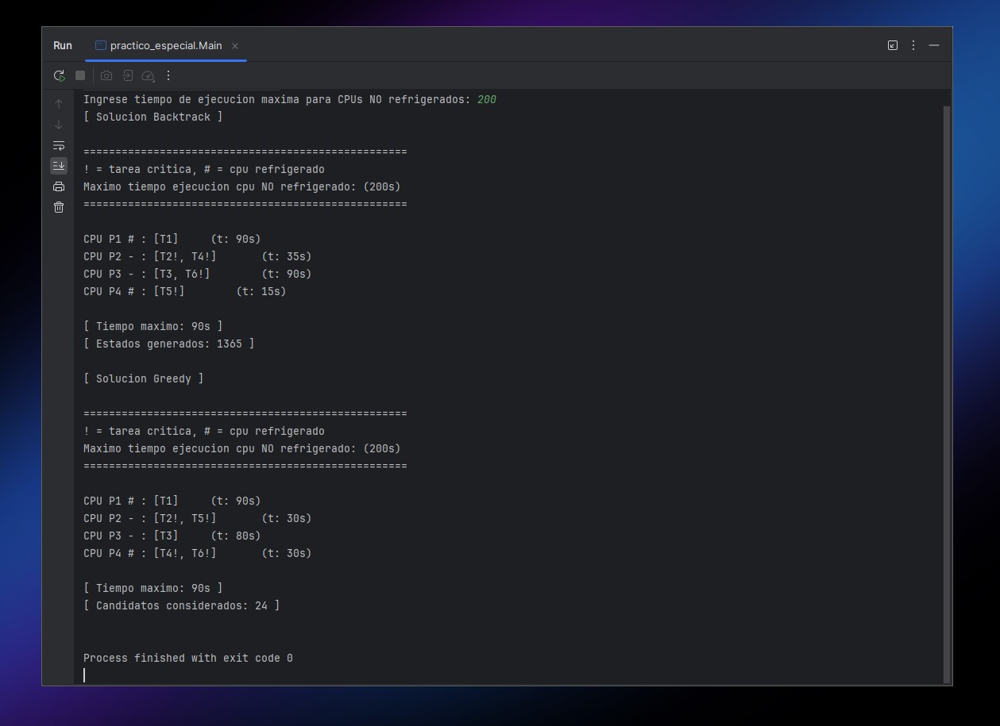
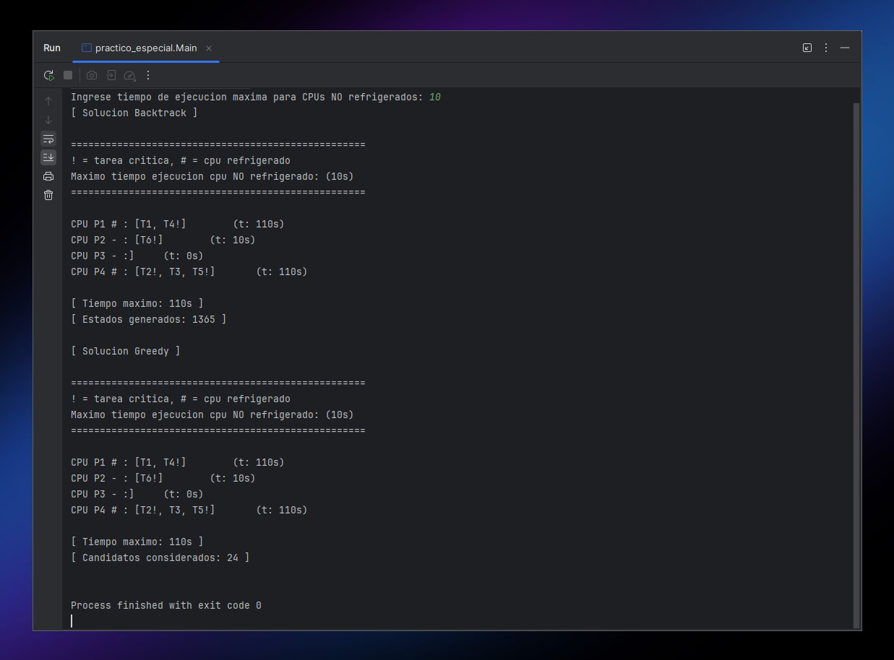
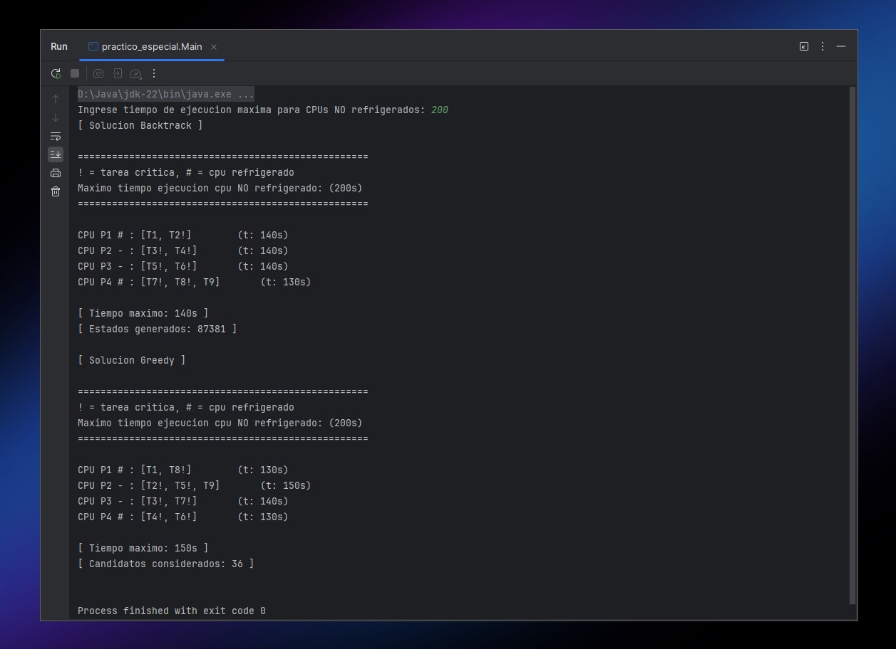
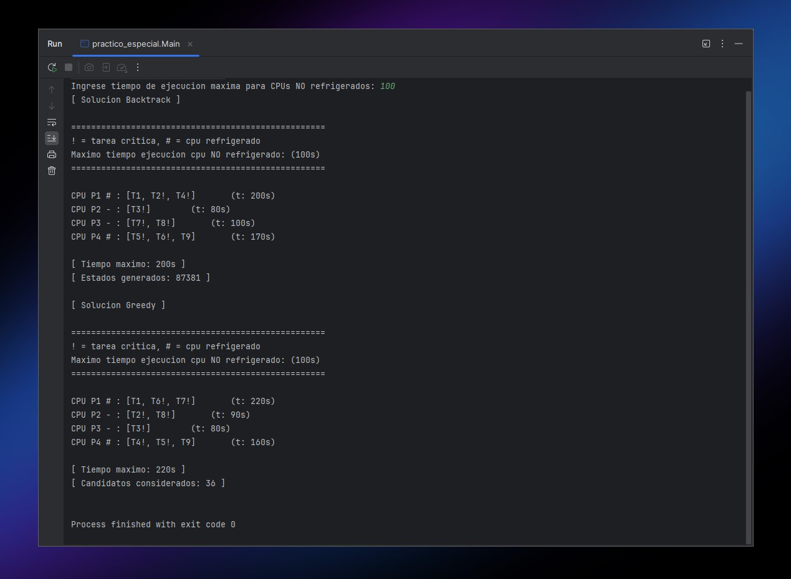
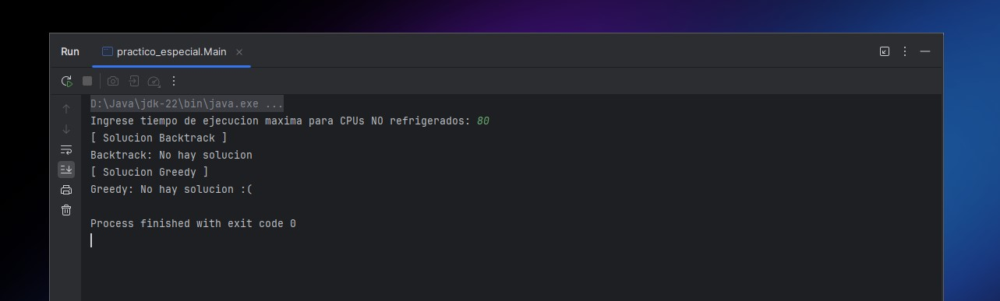

## REENTREGA

El algoritmo de backtracking estaba generando soluciones incorrectas y estados invalidos por dos pequeños errores en la logica de verificacion de solucion valida en `SolucionBacktrack.esValida()` lo cual hacia que se salteara mejores soluciones validas.

(ANTES)
```JAVA
if(critCount >= 2)
		return false;

if(!p.esRefrigerado() && tiempoAcumulado >= maxTiempoEjecucion)
		return false;
```

(DESPUES)
```JAVA
if(critCount > 2)
		return false;

if(!p.esRefrigerado() && tiempoAcumulado > maxTiempoEjecucion)
		return false;
```

### Servicio 1
La complejidad del `servicio1()` es **O(1)**, ya que al guardar las tareas en un **HashMap** con su **idTarea** como clave y la tarea en si como valor, podemos obtener la tarea por su id con una complejidad constante.

### Servicio 2
La complejidad del `servicio2()` es **O(1)**, ya que ademas de tener la lista simple de tareas, tenemos dos listas auxiliares `tareasCriticas` y `tareasNoCriticas`, donde se guardan las tareas criticas y no criticas respectivamente en cada lista, entonces si dependiendo de que tipo de tarea se pide, simplemente se retorna una lista o la otra.

### Servicio 3
La complejidad del `servicio3()` es **O(n)** (en el peor de los casos), ya que si o si hay que recorrer la lista de tareas para encontrar las tareas de prioridad inferior y prioridad superior.

### Constructor
La complejidad del constructor de `Servicios` es **O(n)**.
Se tienen que cargar dos estructuras diferentes (tareas y procesadores), los cuales se hacen mediante dos bucles lineales O(n), lo cual seria O(n1) + (On2), pero se simplifica en O(n)

# CASOS DE TEST
### Tareas1.csv (tiempo max: 200)


### Tareas1.csv (tiempo max: 10)


### Tareas2.csv (tiempo max: 200)


### Tareas2.csv (tiempo max: 100)


### Tareas2.csv (tiempo max: 80)
